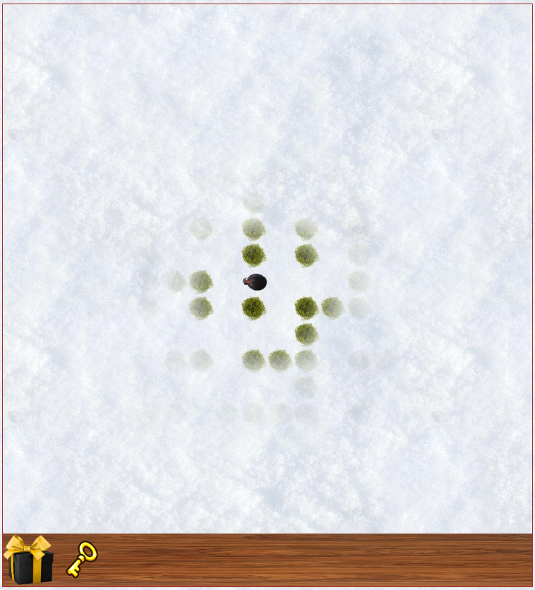
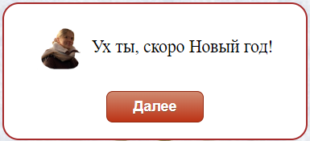

# HappyNewYearAnn

Игра разработана на «чистом» JavaScript в качестве подарка на Новый 2022 год.

## Запуск

Для запуска игры скачай репозиторий и открой файл `index.html` в папке `Game`.

Также игра размещена на `GitHub Pages` и в неё можно поиграть прямо сейчас: https://pashabezk.github.io/HappyNewYearAnn/Game.

> Для запуска надо немного подождать. Загрузка занимает некоторое время (обычно 1-5 минут)

## Описание игры

Вы оказались в лесу, по которому разбросаны подарки. В центре леса находится Аня. Нужно собрать все подарки и принести Ане.

Казалось бы, что может быть проще, но не тут то было. Лес не такой уж маленький, да и видимость у игрока ограниченная, а значит придется попотеть. Кстати, а тебе уже удалось задобрить мишку в лабиринте?

https://github.com/pashabezk/HappyNewYearAnn/assets/60093073/0f26e619-a7e3-41b0-a012-ca4d4e32a45b

В игре также реализовано небольшое текстовое описание, которое более подробно введёт в курс дела, а также поможет взаимодействовать с некоторыми внутриигровыми объектами.

Найди все подарки, отнеси их Ане и новогодняя открытка поднимет твое праздничное настроение!

> Также внутри игры есть секретный уровень. Для его открытия понадобится найти волшебную палочку и портал 😉

> 

> 
<b>Секретная информация</b>

> Внутри проекта есть условная карта игрового пространства. Не раскрывай пункт ниже, пока не попробовал пройти игру самостоятельно!
> 

> 
<b>Я уже прошёл игру и хочу посмотреть как это выглядит</b>

> Карта лежит в папке «DesignFiles» («Карта.jpg»). И всё же попробуй пройти без карты. Насладись игрой!
> 

> 

# С новым годом!

