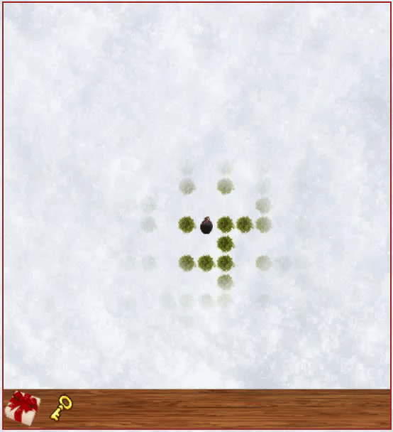
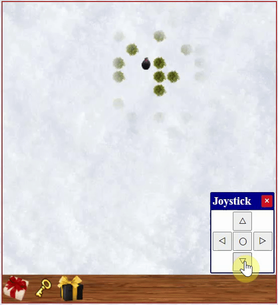

# HappyNewYearAnn

Игра разработана на «чистом» JavaScript в качестве подарка на Новый 2022 год.

## Запуск

#### Вариант 1

Перейти по ссылке: https://pashabezk.github.io/HappyNewYearAnn/Game.

Благодаря `GitHub Pages` в игру могут поиграть все желающие

#### Вариант 2

Скачать репозиторий и открыть файл `index.html` в папке `Game`

## Описание игры

Вы оказались в лесу, по которому разбросаны подарки. В центре леса находится Аня. Нужно собрать все подарки и принести Ане.

Казалось бы, что может быть проще, но не тут то было. Лес не такой уж маленький, да и видимость у игрока ограниченная, а значит придется попотеть. Кстати, а тебе уже удалось задобрить мишку в лабиринте?

Найди все подарки, отнеси их Ане и новогодняя открытка поднимет твое праздничное настроение!

## Механики

### Сообщения

С помощью текстовых сообщений игрок познакомится с игровым миром и сможет взаимодействовать с игровыми объектами.

### Джойстик и свайпы

Чтобы играть с телефона в игре есть джойстик, который можно с легкостью переносить в любую часть экрана. А если джойстик мешает, то его можно скрыть.

На сенсорных экранах можно также передвигаться с помощью свайпов.
> Во многих мобильных браузерах при свайпе сверху вниз можно вызвать перезагрузку страницы, поэтому рекомендуем использовать джойстик

### Секретный уровень

Внутри игры есть секретный уровень. Для его открытия понадобится найти волшебную палочку и портал 😉

> 

> 
<b>Секретная информация</b>

> Внутри проекта есть условная карта игрового пространства. Не раскрывай пункт ниже, пока не попробовал пройти игру самостоятельно!
> 

> 
<b>Я уже прошёл игру и хочу посмотреть как это выглядит</b>

> Карта лежит в папке «DesignFiles» (файл «Карта.jpg»). И всё же попробуй пройти без неё. Насладись игрой!
> 

> 

# С новым годом!

